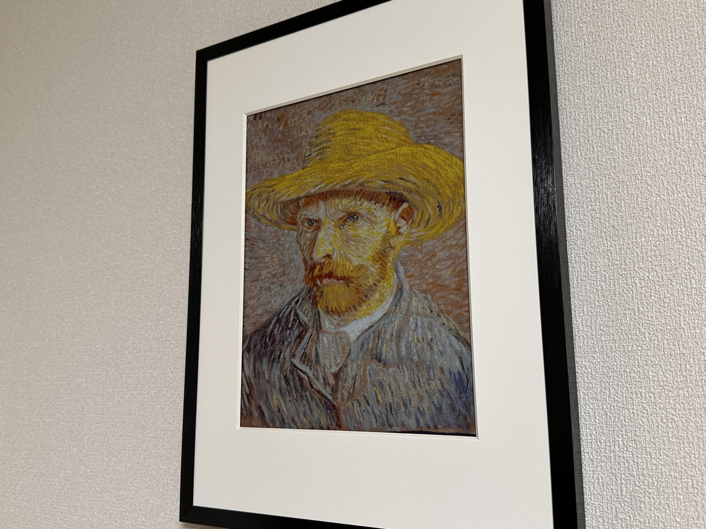
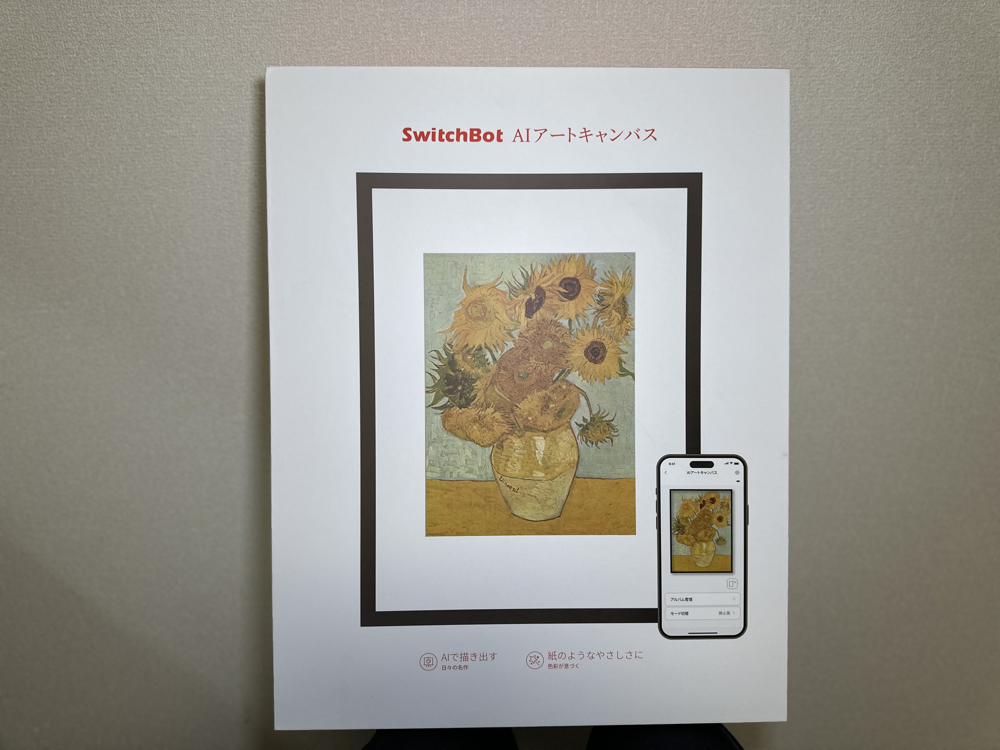
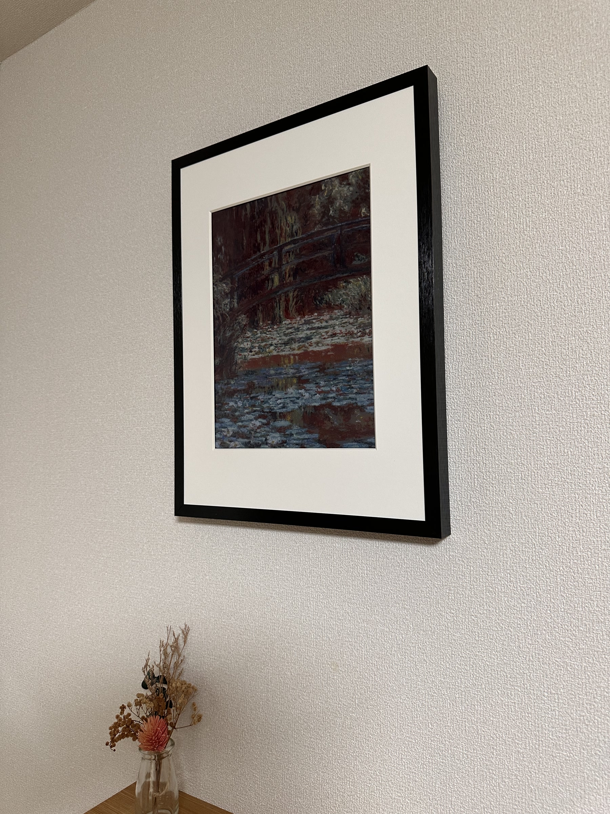
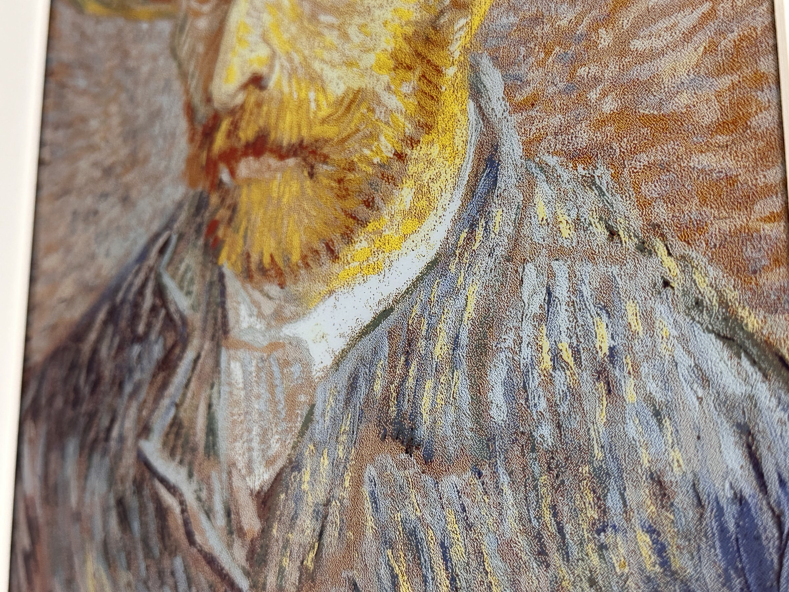
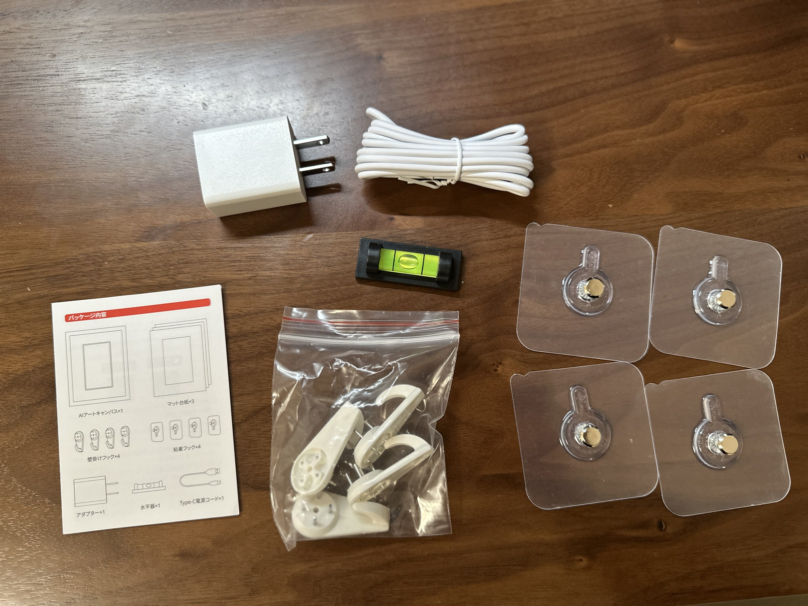
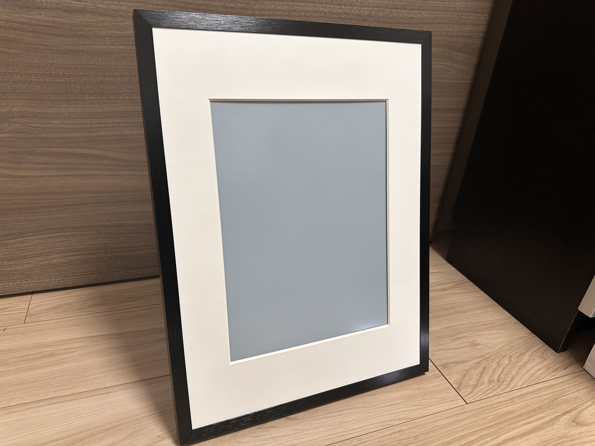
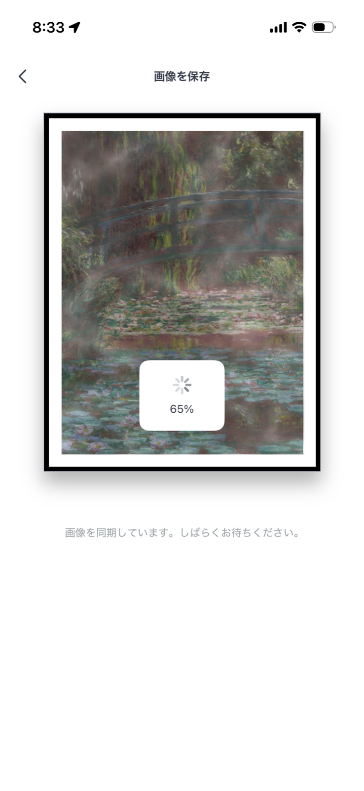

# 【実機レビュー】SwitchBot AIアートフレームは買いか？コードレスで「絵として飾れるか」を13インチで試した感想

<!-- 何を: 記事冒頭のアイキャッチ画像を差し替え。なぜ: 部屋で飾った完成形が最も分かりやすく、レビューの主題と一致するため。 -->

*壁に掛けると、デジタルフォトフレームというより額装アートに近い見え方でした。*

部屋にアートを飾りたいと思っても、紙のポスターや額装だと入れ替えが面倒です。  
一方で、一般的なデジタルフォトフレームは便利でも、どうしても「画面を置いている感」が残りやすい。  
その中間にある製品として気になったのが、`SwitchBot AIアートフレーム`でした。

この記事では、**この製品がデジタルフォトフレームではなく「電子絵画」として成立するか**に絞ってレビューします。  
今回試したのは13インチモデルです。実際に飾ってみて感じた見え方、サイズ感、**電源ケーブルがないことの価値**、AI Studioの必要性、向いている人と向かない人をまとめます。

---

## 結論: 最大の価値はコードレスで飾れること。だから「絵として使いたい人」に向く

最初に結論を書くと、SwitchBot AIアートフレームはかなり面白い製品でした。  
特に良かったのは、**電源ケーブルなしで飾れること**です。  
これがあるだけで、デジタル機器ではなく、部屋に置くアートとして扱いやすくなります。

体感としては、「たまたまコードレスなデジタルフォトフレーム」ではなく、  
**コードが見えないからこそ成立する電子インクの額装アート**に近いです。  
角度を変えて見ても液晶っぽさが出にくく、この見え方とコードレス設計の組み合わせが満足度の中心でした。

ただし、見た目の方向性が一般的なデジタルフォトフレームとはかなり違います。  
発光する液晶のような明るさや鮮やかさはなく、部屋によっては思ったより暗く見えます。  
そのため、家族写真をスライドショーで流したい人より、空間づくりのために絵画を置きたい人の方が満足しやすいです。

---

## なぜ気になったのか: 「アートは飾りたいが、ケーブルは見せたくない」

ポスターや額装アートは、部屋の印象を変える力があります。  
ただ、季節で変えたいときや、その日の気分で差し替えたいときに、毎回入れ替えるのは意外と手間です。

それ以上に大きいのが、壁に飾ったときに**電源ケーブルが出ない**ことでした。  
ここが有線ディスプレイ系の製品と決定的に違う点です。

この製品が面白いのは、公式情報ではフルカラー電子ペーパーを採用し、アプリから表示内容を切り替えられるうえに、コードレス設計になっていることです。  
つまり、「絵画っぽい見え方」「デジタルの差し替えやすさ」「配線が見えないこと」をまとめて成立させようとしているわけです。

液晶のデジタルフォトフレームとは方向性が違うので、  
今回は「便利な表示機器」としてではなく、「部屋に飾る1枚の絵」として見たときに満足できるかを重視しました。

---

## 公式情報で分かること

公式ページや報道ベースで確認できる範囲では、SwitchBot AIアートフレームは次の特徴を持っています。

- 7.3インチ、13.3インチ、31.5インチの3サイズ展開
- フルカラー電子ペーパー `E Ink Spectra 6` を採用
- SwitchBotアプリから表示する画像を切り替え可能
- `AI Studio` に対応し、テキストや写真からアート生成・スタイル変換が可能
- `AI Studio` は公式ページ上で月額590円と案内されている
- 価格は公式情報ベースで7.3インチが24,800円、13.3インチが59,800円、31.5インチが249,800円

ここで重要なのは、スペックそのものよりも**「光る画面」ではなく「反射して見せる画面」で、しかもコードレスで飾れること**です。  
この違いが、満足度をかなり左右します。

<!-- 何を: 製品箱の写真を追加。なぜ: どの製品をレビューしているのかを視覚的に示し、導入直後の理解を助けるため。 -->

---

## 実際に飾って感じたこと: 液晶ではなく、ちゃんと「絵」に寄る

### いちばん効くのは、壁に掛けてもケーブル処理を考えなくていいこと

実際に使ってみて、いちばん大きかったのは見え方そのもの以上に設置の気楽さでした。  
通常のディスプレイ系製品は、壁に飾ろうとすると最後に必ずケーブルの処理が気になります。

この製品はそこをかなりうまく外しています。  
**電源コードが垂れないだけで、部屋の中での見え方が急に「ガジェット」から「額装アート」に寄ります。**

インテリア用途では、この差はかなり大きいです。  
表示品質の話だけでなく、配線を意識せず飾れること自体が、この製品のいちばん強い価値だと感じました。

<!-- 何を: 壁掛け設置時の写真を追加。なぜ: コードレスで飾れる価値を、文章だけでなく実際の部屋の見え方で補強するため。 -->

### 角度を変えても画面感が出にくい

実際に見てまず良かったのはここです。  
液晶のフォトフレームだと、見る角度によっては「ただのディスプレイ」に見えやすいのですが、これはかなり印象が違いました。

電子インクなので、体感としては紙や印刷物に近い見え方です。  
角度を変えても、部屋の中で浮きにくい。  
この点は、「ガジェットを置く」のではなく「絵を飾る」感覚にしっかりつながっていました。

<!-- 何を: 表示の質感が伝わる接写を追加。なぜ: 電子インク特有の落ち着いた見え方を、ディスプレイ写真ではなく実写で示すため。 -->

### ただし、思ったより暗く見える

一方で、最初に感じたのは明るさです。  
デジタルフォトフレームだと思って見ると、思ったより暗く感じます。

ただ、これは欠点というより性格の違いに近いです。  
本物の絵画も自発光しないので、絵として見ればそこまで不自然ではありません。  
今回は13インチを飾りましたが、ダウンライトや間接照明がある場所の方が、見栄えはかなり良くなりそうだと感じました。

---

## サイズ感は要注意: 7.3インチは想像以上に小さい

今回かなり大事だと感じたのがサイズ選びです。

結論から言うと、**絵画として飾りたいなら13インチ以上を強くおすすめします。**  
7.3インチはフレームの存在感が思ったより大きく、表示面の印象としてはハガキサイズに近く感じました。

「壁にアートを飾る」期待で買うと、7.3インチは少し物足りない可能性があります。  
逆に、棚上や玄関などに小さく飾るなら成立します。

31.5インチは価格こそかなり高いですが、もし本格的に部屋の主役になるアートを置きたいなら、かなり魅力的です。  
このクラスまで大きいと、インテリアの印象を変える力は一気に強くなるはずです。

<!-- 何を: サイズごとの向き不向きを比較表で整理。なぜ: 7.3インチと13.3インチで期待値が大きくズレやすく、購入ミスを防ぐため。 -->
## サイズ比較表

| サイズ | 価格の目安 | 飾ったときの印象 | 向いている使い方 |
|---|---:|---|---|
| 7.3インチ | 24,800円 | 小物寄り。表示面は体感的にかなり小さい | 棚上、玄関、小さなアクセント |
| 13.3インチ | 59,800円 | 1枚のアートとして成立しやすい | 書斎、リビング、寝室 |
| 31.5インチ | 249,800円 | 部屋の主役になるサイズ感 | リビングの主役壁面、本格的な空間演出 |

※価格は2026年3月6日時点で確認できた公式系情報ベースです。

---

## 同梱物と設置まわり

同梱物には、壁掛け用のフック類が入っていました。  
この製品は「飾る」前提の設計なので、箱を開けてすぐ壁面設置を考えられるのは分かりやすいです。

<!-- 何を: 同梱物の写真を追加。なぜ: 壁掛け用フックや電源アダプターなど、設置前提の付属品が把握しやすくなるため。 -->

一方で、枠の予備のようなパーツも入っていました。  
手元の確認だけでは用途を断定できず、公式情報でも詳細説明を見つけきれていません。  
この部分は、現時点では「表示や見え方を調整するための付属パーツの可能性がある」程度に留めておきます。

設置した印象としては、やはり普通のガジェットよりも「照明込みで見え方が変わるインテリア」に近いです。  
壁の色や周囲の光量で印象が変わるので、置き場所は少し選びます。

<!-- 何を: 本体前面の写真を追加。なぜ: 何も表示していない状態でも額装アートとして成立するデザインかを示すため。 -->

---

## AI Studioは必要か: 月額590円だが、基本は必須ではない

SwitchBotが用意している`AI Studio`は、公式ページでは**月額590円**のサービスとして案内されています。  
テキストから画像を生成したり、写真を絵画風に変換したりできる機能です。  
新しさはありますが、正直に言うと**全員に必要な機能ではない**と感じました。

理由はシンプルで、自分で用意した画像をアップロードすれば十分楽しめるからです。  
たとえば名画やパブリックドメイン作品を飾りたいなら、美術館や公開アーカイブにある画像データを使う選択肢もあります。  
自分で画像生成をしている人なら、その作品をそのまま表示する使い方でも成立します。

<!-- 何を: アプリ画面のスクリーンショットを追加。なぜ: AI Studioや画像同期の雰囲気を、本文の説明と対応づけて示すため。 -->

つまり、AI Studioは「あったら遊べる機能」ではありますが、  
この製品の本質はAI生成よりも、**好きな絵をコードレスで、絵画っぽく飾れること**にあると思います。

---

<!-- 何を: 競合カテゴリとの違いを比較表で可視化。なぜ: AIアートフレームが「何の代替品なのか」を整理しないと、期待外れが起きやすいため。 -->
## 比較表: デジタルフォトフレームやスマートディスプレイと何が違うか

この製品を比較するとき、競合はスマートホーム機器というより、  
**デジタルフォトフレームやスマートディスプレイ**だと思います。  
ただし、狙っている価値はかなり異なります。

| 比較軸 | SwitchBot AIアートフレーム | 一般的なデジタルフォトフレーム | スマートディスプレイ |
|---|---|---|---|
| 主な目的 | 絵画・アートを飾る | 写真を明るく表示する | 情報表示と音声操作 |
| 見え方 | 紙や絵に近い、落ち着いた表示 | 明るくくっきり、画面感が出やすい | かなり機械的 |
| 配線の見え方 | コードレスで飾りやすい | 給電前提が多い | 給電前提 |
| 部屋とのなじみ | 高い | 置き方による | 低め |
| 得意なコンテンツ | 絵画、イラスト、静止画アート | 家族写真、スライドショー | 時計、天気、動画、音楽 |
| 切り替え頻度との相性 | ときどき変える使い方向き | 頻繁な写真切り替え向き | 常時情報表示向き |
| 向いている人 | 空間づくりを重視する人 | 思い出写真を楽しみたい人 | 生活情報と操作性を重視する人 |

この比較で分かりやすいのは、  
SwitchBot AIアートフレームが「便利な表示機器」ではなく、**雰囲気を整えるための表示機器**だということです。

家族写真を何十枚も流したいなら、一般的なデジタルフォトフレームの方が満足しやすいと思います。  
逆に、部屋にきれいな絵画を置きたい人には、この製品ならではの価値があります。

---

## 良かった点

- 電子インクらしい落ち着いた見え方で、絵として飾りやすい
- 電源ケーブルが見えないので、壁掛けでもインテリアを崩しにくい
- 角度を変えてもディスプレイ感が出にくい
- アプリで中身を入れ替えられるので、紙の額装より気軽
- 13インチ以上なら、インテリアとしての満足感を出しやすい

## 気になった点

- 液晶のデジタルフォトフレームと比べると暗く感じやすい
- 7.3インチは絵画用途だと小さく感じやすい
- AI Studioは月額590円で、話題性はあるが必須機能とは言いにくい
- 31.5インチは魅力的だが価格のハードルがかなり高い

---

## 買うべき人 / 見送ってよい人

### 買うべき人

- 部屋に絵画のような見た目でアートを飾りたい人
- 季節や気分でアートを差し替えたい人
- デジタルフォトフレームの画面感が気になっていた人
- まずは13インチ以上で、空間づくりの一部として使いたい人

### 見送ってよい人

- 家族写真を明るくスライドショー表示したい人
- 動画や時計、天気表示まで1台に任せたい人
- 7.3インチに「壁の主役になる絵」を期待している人
- AI機能がなければ価値を感じにくい人

---

## まとめ

SwitchBot AIアートフレームは、ジャンルとしてはかなり珍しい製品ですが、  
実際に触ると「デジタルフォトフレームの亜種」ではなく、「コードレスで飾れるデジタル絵画」に近い立ち位置だと感じました。

その意味では、刺さる人にはかなり刺さります。  
特に、家の中にきれいな絵画を置きたい人にとっては、十分価値がある製品です。  
最大の理由は、電子インクの見え方だけでなく、**配線を見せずに飾れること**にあります。

一方で、明るい液晶表示や写真スライドショーを期待すると、満足度はずれるはずです。  
購入するなら、`写真立て`ではなく`アートフレーム`として考えるのがいちばんしっくりきます。

絵画として飾る前提なら、個人的には7.3インチより13インチがおすすめです。  
もっと部屋の印象を変えたいなら、価格は高いものの31.5インチもかなり面白い選択肢だと思います。

---

<!-- 何を: 公式情報と外部参照元を明記。なぜ: 実体験と仕様情報の境界を明確にし、公開時の確認元を残すため。 -->
## 参考にした情報

- SwitchBot公式製品ページ: https://www.switchbot.jp/products/switchbot-ai-art-frame
- ITmedia PC USER掲載情報: https://www.itmedia.co.jp/pcuser/articles/2511/07/news093.html
- Van Gogh Museum Collection: https://www.vangoghmuseum.nl/en/collection
